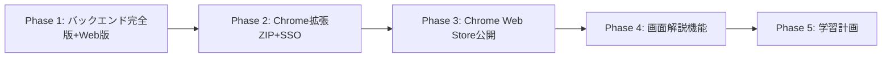

Title: Product Roadmap
Description: Phase別の開発スコープと移行条件
Owner: @ttokunaga-ja
Reviewers: @reviewer1
Status: Published
Last-updated: 2026-02-18
Tags: product, roadmap

# Product Roadmap

## Phase 1: バックエンド完全版 + Web版完全動作(2026 Q1)

### ゴール
バックエンド機能の完全実装（Kafka/gRPC含む）＋ ローカルでのWeb版全機能動作確認

### スコープ
- 固定dev-user（`dev@example.com`）、認証UIなし
- ローカル環境（docker-compose）
- Web版の全固有機能（科目プルダウン・資料一覧・会話履歴）
- Professor ↔ Librarian gRPC双方向ストリーミング（Phase 1から完全実装）
- Kafka非同期パイプライン（OCR/Embedding）
- curlによる認証不要アップロード（ローカルテスト用）

### 完了条件
- [ ] `eduanimaR_Professor/docs/openapi.yaml`定義完了（新エンドポイント設計）
- [ ] `eduanimaR_Professor/proto/librarian/v1/librarian.proto`定義完了
- [ ] Professor: ファイルアップロード→Kafka→OCR→Embedding→検索が動作
- [ ] Librarian: gRPC双方向ストリーミング（`Think` RPC）が動作
- [ ] Professor ↔ Librarian gRPC通信が確立されている
- [ ] フロントエンド: Orvalで型生成→質問応答SSEが動作
- [ ] フロントエンド: Web版固有機能（科目プルダウン・資料一覧・会話履歴）が動作
- [ ] docker-composeでProfessor + PostgreSQL + Kafka + Librarianが起動

### Phase 2への移行条件
- 上記完了条件を全て満たす
- DB_SCHEMA_DESIGN.mdのテーブル定義が実装されている
- Phase 1完了指標: 検索成功率70%以上、p95応答時間5秒以内

---

## Phase 2: Chrome拡張機能（ZIP配布）+ SSO認証(2026 Q2)

### ゴール
Chrome拡張機能のZIPファイル配布と、SSO認証による本番運用開始

### スコープ
- Chrome拡張機能（Plasmo / Manifest V3）→ ZIPファイル配布
- SSO認証（Google/Meta/Microsoft/LINE）
- Moodle資料の自動検知・自動アップロード
- LMSコース判別 → subject_id 物理制限
- Cloud Runデプロイ（Professor/Librarian）
- プライバシーポリシー/利用規約の法務確認

### 完了条件
- [ ] SSOログイン→科目作成→質問応答が動作（Web版・拡張機能版）
- [ ] Web版デプロイ（Cloud Run）
- [ ] Chrome拡張機能ZIPファイルで動作確認
- [ ] Moodle資料の自動検知・自動アップロードが動作
- [ ] LMSコース判別→subject_id物理制限が動作
- [ ] プライバシーポリシー/利用規約の法務確認完了
- [ ] `users`テーブルの`provider`, `provider_user_id`カラムが使用可能（Phase 1から追加済み）
- [ ] 固定dev-user削除済み

### Phase 3への移行条件
- 上記完了条件を全て満たす
- Web版・拡張機能版が1週間安定稼働（エラー率 < 1%）

---

## Phase 3: Chrome Web Store公開(2026 Q3)

### ゴール
Chrome Web Storeでの正式公開

### スコープ
- Chrome Web Store審査対応（プライバシーポリシー・スクリーンショット等）
- Chrome Web Store公開（非公開配布 → 公開配布へ移行）
- Web版・バックエンドはPhase 2から変更なし

### 完了条件
- [ ] Chrome Web Store審査通過
- [ ] Chrome Web Store公開（限定公開 or 一般公開）

### Phase 4への移行条件
- Chrome拡張が100ユーザー以上利用
- フィードバック収集完了

---

## Phase 4: 閲覧画面解説機能(2026 Q4)

### ゴール
小テスト復習支援（間違った原因を資料をもとに考える支援）

### スコープ
- 現在閲覧中LMS画面のHTML取得
- 画面内に表示されている画像ファイル取得（図・グラフ等）
- 取得したHTML・画像をProfessor APIへ送信→LLM解析
- 資料を根拠とした解説生成
- 短期保存（7日後自動削除）

### 完了条件
- [ ] `screen_analyses`テーブル追加
- [ ] 画面HTML+画像の取得・送信が動作
- [ ] 資料を根拠とした解説生成が動作
- [ ] 7日後自動削除の実装完了
- [ ] プライバシー配慮の短期保存実装

### Phase 5への移行条件
- 画面解析精度が80%以上（人手評価）

---

## Phase 5: 学習計画機能（構想段階）(2027 Q1~)

### ゴール
個別最適化された学習ロードマップ（構想段階・詳細はPhase 1〜4完了後に検討）

### 備考（構想レベル）
- 過去の小テスト結果を取得・分析し、既存資料のどこを確認すべきか・どの順序で学ぶべきかをチャット形式で提案する機能を想定
- 実装方針・DB設計・プライバシー配慮は未確定

---

## 依存関係

## リスク管理

### Phase 1リスク
- **リスク**: pgvector HNSW性能が要件を満たさない
- **対策**: Phase 1でベンチマーク実施、必要なら全文検索のみに縮退
- **リスク**: gRPC双方向ストリーミングの実装遅延
- **対策**: proto定義を先行して確定し、モックで並行開発を進める

### Phase 2リスク
- **リスク**: OAuth実装の脆弱性
- **対策**: OWASP API Security Top 10に準拠したセキュリティレビュー
- **リスク**: Moodle DOM構造の変更による自動検知の失敗
- **対策**: MutationObserverのフォールバック処理を実装

### Phase 3リスク
- **リスク**: Chrome Web Store審査不合格
- **対策**: Manifest V3ベストプラクティス遵守、事前にポリシー確認

### Phase 4リスク
- **リスク**: 画面データ保存がプライバシー違反
- **対策**: 7日自動削除、ユーザー同意取得、法務確認

### Phase 5リスク
- **リスク**: 学習計画が不正確で学習者に悪影響
- **対策**: A/Bテスト、フィードバック収集、人手レビュー（詳細はPhase 4完了後に検討）
