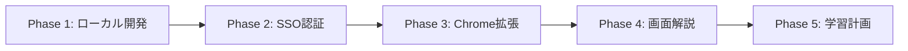

Title: Product Roadmap
Description: Phase別の開発スコープと移行条件
Owner: @ttokunaga-ja
Reviewers: @reviewer1
Status: Published
Last-updated: 2026-02-17
Tags: product, roadmap

# Product Roadmap

## Phase 1: ローカル開発(2026 Q1)

### ゴール
Professor+Librarian基本動作確認(認証スキップ)

### スコープ
- 固定ユーザー(`dev@example.com`)
- ローカル環境(docker-compose)
- Web UIのみ(拡張なし)

### 完了条件
- [ ] `eduanimaR_Professor/docs/openapi.yaml`定義完了
- [ ] `eduanimaR_Professor/proto/librarian/v1/librarian.proto`定義完了
- [ ] Professor: ファイルアップロード→OCR→Embedding→検索が動作
- [ ] Librarian: HTTP REST API(`POST /agent/librarian/think`)が動作
- [ ] フロントエンド: Orvalで型生成→質問応答SSEが動作
- [ ] docker-composeでProfessor+PostgreSQL+Kafkaが起動

### Phase 2への移行条件
- 上記完了条件を全て満たす
- DB_SCHEMA_DESIGN.mdのPhase 1定義が実装されている

---

## Phase 2: SSO認証・Web版公開(2026 Q2)

### ゴール
一般ユーザー向けWeb版公開

### スコープ
- OAuth実装(Google/Meta/Microsoft/LINE)
- Cloud Runデプロイ
- プライバシーポリシー/利用規約の法務確認

### 完了条件
- [ ] SSOログイン→科目作成→質問応答が動作
- [ ] Web版デプロイ(https://eduanimar.example.com)
- [ ] プライバシーポリシー/利用規約の法務確認完了
- [ ] `users`テーブルに`provider`, `provider_user_id`追加済み
- [ ] 固定ユーザー削除済み

### Phase 3への移行条件
- 上記完了条件を全て満たす
- Web版が1週間安定稼働(エラー率 < 1%)

---

## Phase 3: Chrome拡張公開(2026 Q3)

### ゴール
LMS上での利用体験向上

### スコープ
- Chrome拡張機能(Manifest V3)
- gRPC双方向ストリーミング実装
- Chrome Web Store公開

### 完了条件
- [ ] gRPC双方向ストリーミング(Professor ↔ Librarian)実装
- [ ] Chrome拡張でLMS資料自動検知
- [ ] Chrome Web Store審査通過

### Phase 4への移行条件
- Chrome拡張が100ユーザー以上利用
- フィードバック収集完了

---

## Phase 4: 画面解説機能(2026 Q4)

### ゴール
小テスト復習支援

### スコープ
- LMS画面HTML解析
- Vision Reasoning(画像解析)
- 短期保存(7日後自動削除)

### 完了条件
- [ ] `screen_analyses`テーブル追加
- [ ] 画面解析→復習提案が動作
- [ ] プライバシー配慮の短期保存実装

### Phase 5への移行条件
- 画面解析精度が80%以上(人手評価)

---

## Phase 5: 学習計画機能(2027 Q1)

### ゴール
個別最適化された学習ロードマップ

### スコープ
- 学習計画生成
- 小テスト結果分析
- 匿名化処理

### 完了条件
- [ ] 学習計画生成API実装
- [ ] 匿名化処理実装

---

## 依存関係

## リスク管理

### Phase 1リスク
- **リスク**: pgvector HNSW性能が要件を満たさない
- **対策**: Phase 1でベンチマーク実施、必要なら全文検索のみに縮退

### Phase 2リスク
- **リスク**: OAuth実装の脆弱性
- **対策**: OWASP API Security Top 10に準拠したセキュリティレビュー

### Phase 3リスク
- **リスク**: Chrome Web Store審査不合格
- **対策**: Manifest V3ベストプラクティス遵守、事前にポリシー確認

### Phase 4リスク
- **リスク**: 画面データ保存がプライバシー違反
- **対策**: 7日自動削除、ユーザー同意取得、法務確認

### Phase 5リスク
- **リスク**: 学習計画が不正確で学習者に悪影響
- **対策**: A/Bテスト、フィードバック収集、人手レビュー
