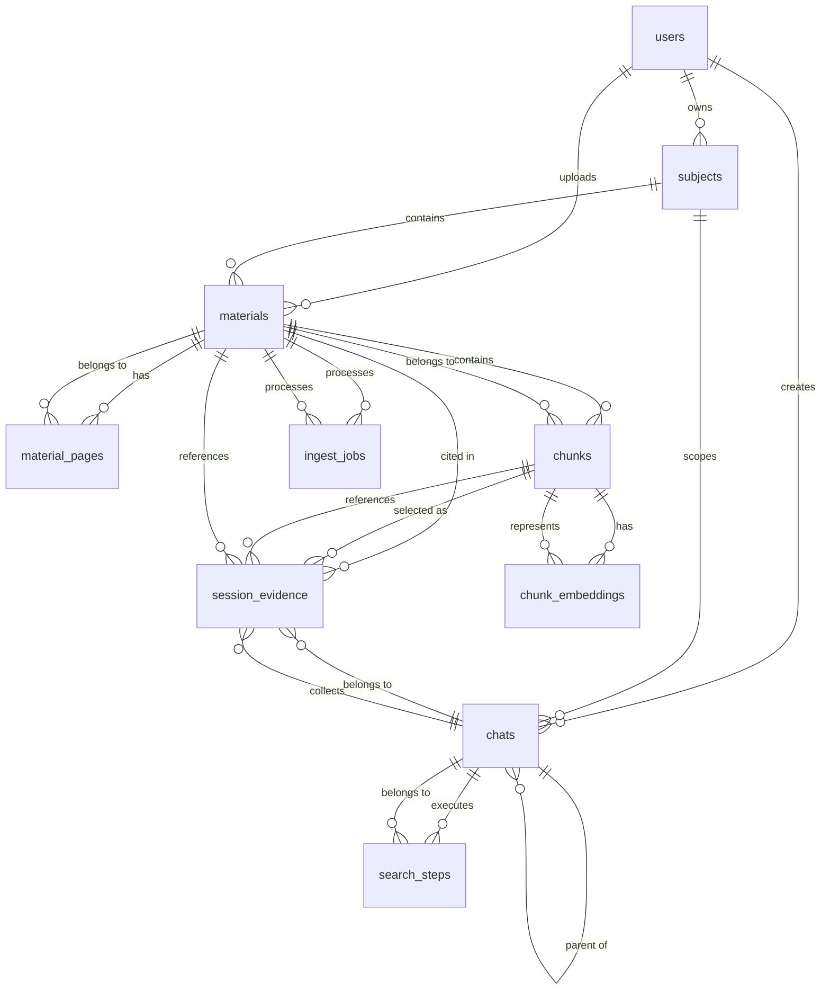
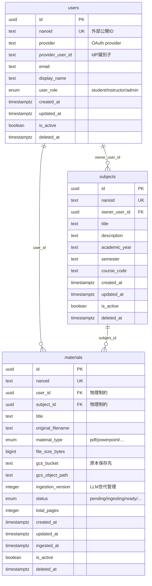
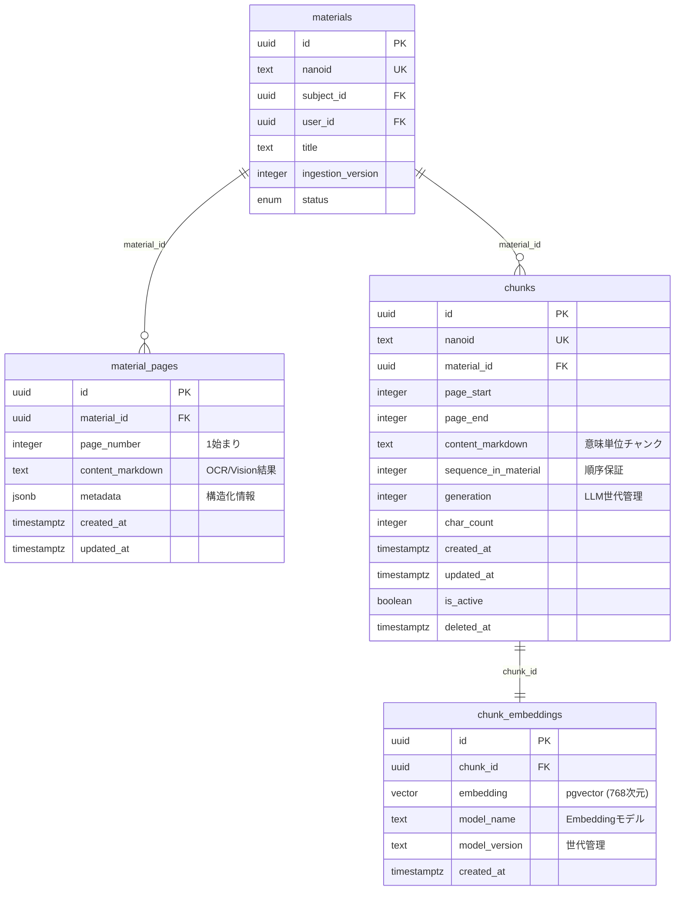
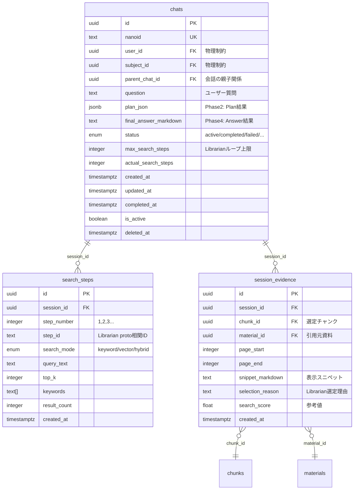
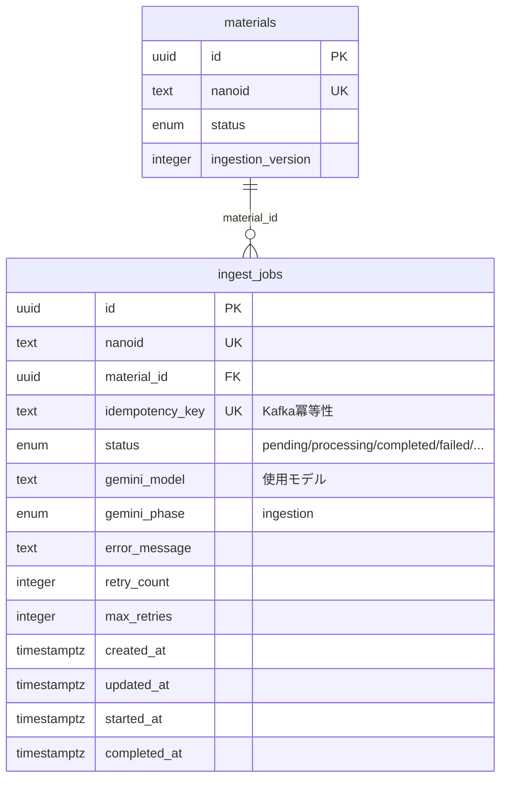
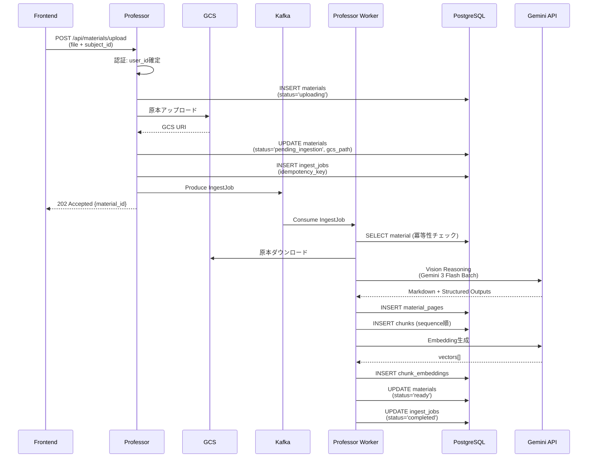
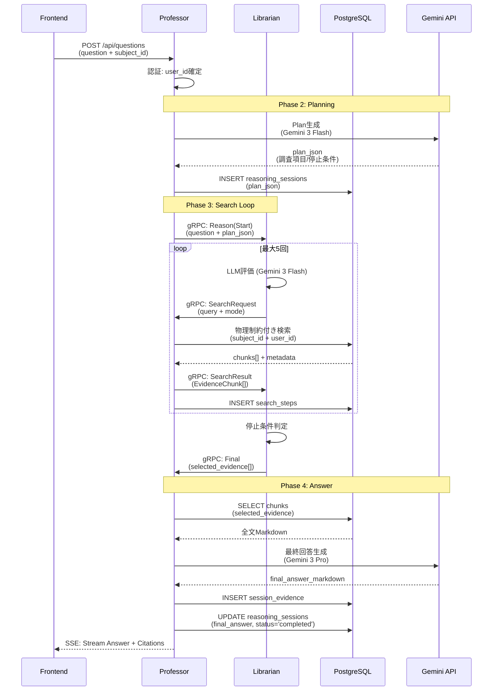
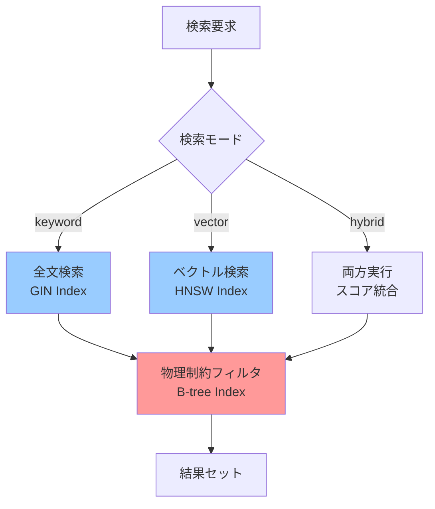
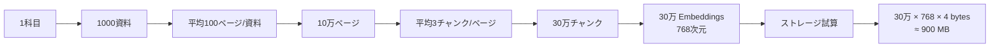
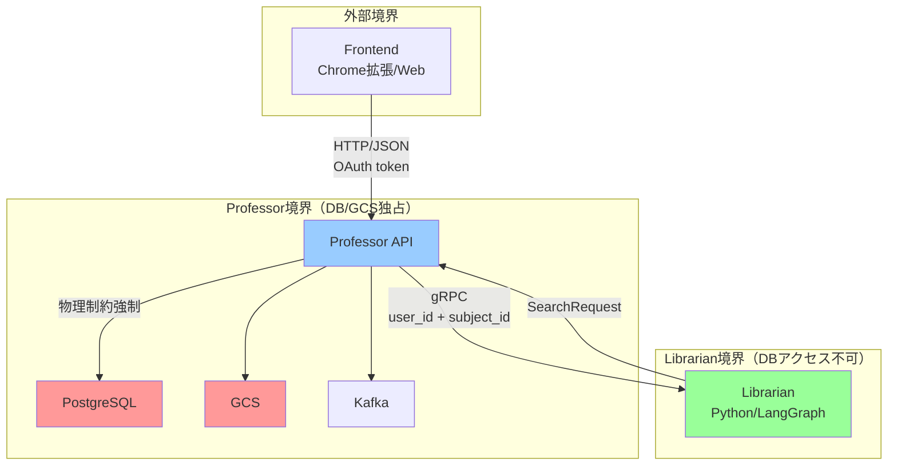

# DB_SCHEMA_ERD

## 目的
eduanima-professor のデータベーススキーマを視覚的に理解するためのER図（Entity-Relationship Diagram）。

> 本ファイルは [DB_SCHEMA_TABLES.md](./DB_SCHEMA_TABLES.md) の視覚的補完資料。

---

## 全体構成図



---

## コアエンティティ（ドメインモデル）



---

## 資料・チャンク・Embedding



---

## 推論セッション・検索・根拠



---

## 非同期処理（Ingest Jobs）



---

## 物理制約の強制（Security Boundary）

### 検索クエリでの強制パターン

```mermaid
graph TD
    A[Librarian: 検索要求] -->|gRPC: SearchRequest| B[Professor: 検索実行]
    B --> C{物理制約チェック}
    C -->|user_id| D[users.id]
    C -->|subject_id| E[subjects.id]
    C -->|is_active=true| F[ソフトデリート除外]
    D --> G[WHERE句に強制追加]
    E --> G
    F --> G
    G --> H[PostgreSQL検索実行]
    H --> I[結果セット]
    I -->|EvidenceChunk[]| J[Librarian: 評価]
    
    style C fill:#ff9999
    style G fill:#ff9999
    style H fill:#99ccff
```

### SQLでの実装例

```sql
-- ❌ 禁止: 物理制約なし（全データアクセス可能）
SELECT * FROM chunks WHERE content_markdown @@ :query;

-- ✅ 必須: 物理制約を強制
SELECT c.* 
FROM chunks c
JOIN materials m ON c.material_id = m.id
WHERE m.subject_id = :subject_id     -- 科目スコープ
  AND m.user_id = :user_id           -- ユーザースコープ
  AND m.is_active = TRUE             -- アクティブのみ
  AND c.is_active = TRUE
  AND c.content_markdown @@ :query;
```

---

## データフロー: Ingestion Loop



---

## データフロー: Reasoning Loop



---

## インデックス戦略

### 検索パフォーマンスの最適化



### インデックス一覧

| テーブル | インデックス | タイプ | 用途 |
|---------|------------|-------|------|
| users | `idx_users_provider` | B-tree | OAuth認証 |
| users | `idx_users_email` | B-tree | メール検索 |
| materials | `idx_materials_subject_user` | B-tree | **物理制約（主経路）** |
| chunks | `idx_chunks_material_seq` | B-tree | 順序保証取得 |
| chunks | `idx_chunks_content_fts` | GIN | **全文検索** |
| chunk_embeddings | `idx_chunk_embeddings_vector` | HNSW | **ベクトル検索** |

---

## スケーラビリティ考慮事項

### データ規模の見積もり（単一科目）



### パーティショニング戦略（将来拡張）

```sql
-- 科目単位でのパーティショニング（大規模化時）
CREATE TABLE chunks_partitioned (
    LIKE chunks INCLUDING ALL
) PARTITION BY HASH (subject_id);

-- 月次パーティショニング（reasoning_sessions）
CREATE TABLE reasoning_sessions_partitioned (
    LIKE reasoning_sessions INCLUDING ALL
) PARTITION BY RANGE (created_at);
```

---

## セキュリティ境界の可視化



---

## 関連ドキュメント
- [DB_SCHEMA_TABLES.md](./DB_SCHEMA_TABLES.md) - テーブル定義（SSOT）
- [DB_SCHEMA_DISCUSSION.md](./DB_SCHEMA_DISCUSSION.md) - 議論ポイント
- [DB_SCHEMA_DESIGN.md](./DB_SCHEMA_DESIGN.md) - 設計原則
- [MICROSERVICES_MAP.md](./MICROSERVICES_MAP.md) - サービス境界
